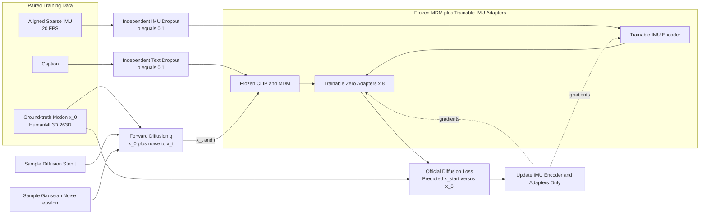
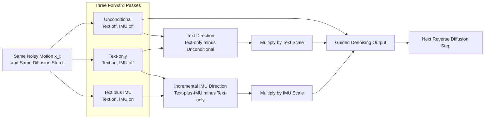

# ITM Current Model Architecture

本文档描述当前已经实现并训练的 ITM 模型，即 **Frozen MDM + Sparse IMU
Control Adapters**。代码级描述以
`outputs/mdm_control/stage1_full_pilot_v2.pt` 为准；论文级抽象图只省略工程细节，
不增加当前代码中不存在的模块。

## 1. 一句话概述

ITM 保留预训练 MDM 的文本到动作生成能力，同时用一个轻量时序 IMU encoder
提取稀疏身体传感器信号，并通过每层独立的零初始化线性 adapter 将 IMU residual
注入冻结的 MDM Transformer，从而实现文本语义与 IMU 时序约束的联合控制。

## 2. 输入、输出与符号

### 2.1 输入

| 模态 | 当前表示 | 形状 | 处理方式 |
| --- | --- | --- | --- |
| Text | HumanML3D caption | `B` strings | 冻结 CLIP ViT-B/32 |
| Noisy motion | HumanML3D 263D | `[B,263,1,T]` | MDM diffusion state `x_t` |
| IMU acceleration | 三轴加速度 | `[B,T,6,3]` | 训练集均值/方差标准化 |
| IMU orientation | 3x3 全局方向矩阵 | `[B,T,6,3,3]` | 展平为 9D，不做标准化 |
| Sensor mask | 有效传感器槽位 | `[B,6]` | 屏蔽未使用槽位 |
| Frame mask | 有效时间步 | `[B,T]` | 屏蔽 padding frame |

每个传感器每帧最终表示为：

```text
IMU feature = normalized acceleration (3D) + flattened orientation (9D) = 12D
```

固定的 6 个标准槽位为：

| Slot | English label | 中文部位 |
| ---: | --- | --- |
| 0 | Left Wrist | 左手腕 |
| 1 | Right Wrist | 右手腕 |
| 2 | Left Thigh | 左大腿 |
| 3 | Right Thigh | 右大腿 |
| 4 | Head | 头部 |
| 5 | Pelvis | 骨盆 |

当前融合模型只用以下两种训练配置：

- `head`: slot 4，单个头部 IMU。
- `wrists`: slots 0、1，双手腕 IMU。

注意：融合 MDM 的输入保留 6 个槽位；Flexible IMUPoser 基线只使用前 5 个
槽位。这是两个不同模型的接口，不应在图中混为一体。

### 2.2 时间对齐

- 标准虚拟 IMU 缓存由 AMASS/SMPL 生成，缓存频率为 30 FPS。
- 加速度通过线性插值重采样到 20 FPS。
- 方向矩阵通过 rotation Slerp 重采样到 20 FPS。
- HumanML3D motion 与 IMU 截取共同有效长度，最长 `T=196` frames。

### 2.3 输出

MDM 预测去噪后的 HumanML3D 263D motion representation。推理结束后：

1. 使用 HumanML3D `Mean.npy` 和 `Std.npy` 反归一化。
2. 使用 `recover_from_ric` 恢复 22 个 HumanML3D joints。
3. 输出关节位置形状为 `[B,T,22,3]`。

当前融合模型**不是直接输出 SMPL rotations**。SMPL rotation 输出属于 IMUPoser
基线，不属于当前 ITM 生成骨干。

## 3. 当前代码级架构

### 3.1 冻结的 MDM 主干 / Frozen MDM Backbone

当前使用官方 HumanML3D MDM checkpoint：

```text
humanml_trans_enc_512/model000475000.pt
```

主要配置：

| Component | Configuration |
| --- | --- |
| Text encoder | Frozen CLIP ViT-B/32 |
| Motion representation | HumanML3D 263D |
| Latent width | 512 |
| Backbone | 8-layer Transformer Encoder |
| Diffusion steps | 1000 |
| Prediction target | Denoised motion / predicted x_start |
| Maximum sequence length | 196 frames at 20 FPS |

MDM 将 diffusion timestep embedding 与 projected CLIP text embedding 相加，形成
一个 condition token。该 token 被放在 `T` 个 motion tokens 前面，因此
Transformer 内部序列长度为 `T+1`。

### 3.2 IMU control encoder / IMU 控制编码器

IMU encoder 的实际计算顺序如下：

1. 每个槽位的 12D IMU feature 通过共享线性层投影到 512D。
2. 加上可学习的 512D sensor/part embedding，用于区分身体部位。
3. 乘以 sensor mask 后，在传感器维度做 masked mean pooling。
4. 得到每帧一个 512D token，形状为 `[B,T,512]`。
5. 送入 2 层、8 heads、2048D FFN 的 temporal Transformer Encoder。
6. 得到时序 control feature `C_imu`，形状仍为 `[B,T,512]`。

公式化表示：

```text
h[t,s] = Linear12to512(imu[t,s]) + SensorEmbedding[s]
h[t]   = MaskedMean_s(h[t,s], sensor_mask[s])
C_imu  = TemporalTransformer2Layers(h, frame_mask)
```

当前实现是在进入时序 Transformer **之前**进行多传感器 masked mean，不是每个
传感器单独进行完整时序编码后再融合。

### 3.3 Zero-initialized residual adapters / 零初始化残差适配器

官方 MDM 的 8 层 Transformer 保持原参数。每一层后增加一个独立的
`Linear(512,512)` adapter：

```text
H_l = MDMTransformerLayer_l(H_l-1)
H_l = H_l + ZeroLinear_l(C_imu)
```

- 共 8 个 adapter，各层参数不共享。
- 每个 adapter 的 weight 与 bias 均初始化为 0。
- 初始化时模型行为与原始 MDM 完全一致。
- 训练时仅 adapter 和 IMU encoder 更新。
- 同一份 `C_imu` 送入所有层，但各层使用不同 adapter 投影。
- MDM 的 condition token 没有对应 IMU frame，因此在 control 序列前补一个
  512D 零 token，使 control 与 `T+1` MDM tokens 对齐。

当前方法借鉴 ControlNet 的“零初始化 residual control”思想，但**没有复制一套
MDM backbone**，因此准确名称应为 ControlNet-style adapter，而不是完整
ControlNet。

## 4. 整体架构图 / Overall Architecture

```mermaid
flowchart LR
    subgraph DATA[Data and Preprocessing]
        TXT[HumanML3D Caption]
        IMU[Standard Sparse IMU<br/>B x T x 6 x 12]
        XT[Noisy Motion x_t<br/>B x 263 x 1 x T]
        MASK[Sensor Mask<br/>B x 6]
        PRE[30 to 20 FPS Alignment<br/>Acceleration normalization]
        IMU --> PRE
        MASK --> PRE
    end

    subgraph FROZEN[Frozen MDM Backbone]
        CLIP[Frozen CLIP ViT-B/32]
        COND[Text plus Timestep<br/>Condition Token 1 x B x 512]
        MPROJ[Motion Input Projection<br/>263 to 512]
        TOKENS[MDM Token Sequence<br/>T plus 1 x B x 512]
        L1[Transformer Layer 1]
        LDOTS[Transformer Layers 2 to 7]
        L8[Transformer Layer 8]
        OUT[Motion Output Projection<br/>512 to 263]
        CLIP --> COND
        COND --> TOKENS
        MPROJ --> TOKENS
        TOKENS --> L1 --> LDOTS --> L8 --> OUT
    end

    subgraph TRAINABLE[Trainable IMU Control Branch]
        PROJ[Shared Feature Projection<br/>12 to 512]
        PART[Sensor or Part Embedding<br/>6 x 512]
        POOL[Masked Mean over Sensors<br/>B x T x 512]
        TEMP[Temporal Transformer<br/>2 Layers, 8 Heads]
        CTRL[IMU Control C_imu<br/>B x T x 512]
        A1[Zero Linear Adapter 1]
        ADOTS[Zero Linear Adapters 2 to 7]
        A8[Zero Linear Adapter 8]
        PRE --> PROJ
        PART --> POOL
        PROJ --> POOL --> TEMP --> CTRL
        CTRL --> A1
        CTRL --> ADOTS
        CTRL --> A8
    end

    TXT --> CLIP
    XT --> MPROJ
    A1 -. residual .-> L1
    ADOTS -. residual .-> LDOTS
    A8 -. residual .-> L8
    OUT --> VEC[Generated HumanML3D Motion<br/>B x 263 x 1 x T]
    VEC --> RIC[Inverse Normalize and recover_from_ric]
    RIC --> J22[Generated Full-body Motion<br/>B x T x 22 x 3]

    classDef frozen fill:#dfe8f5,stroke:#416a9c,color:#17202a;
    classDef trainable fill:#dff3ea,stroke:#258267,color:#17202a;
    classDef data fill:#f2ead8,stroke:#9c7a38,color:#17202a;
    class CLIP,COND,MPROJ,TOKENS,L1,LDOTS,L8,OUT frozen;
    class PROJ,PART,POOL,TEMP,CTRL,A1,ADOTS,A8 trainable;
    class TXT,IMU,XT,MASK,PRE data;
```



## 5. 训练流程 / Training Pipeline

### 5.1 可训练与冻结参数

**Frozen：**

- CLIP text encoder。
- MDM input/output projection。
- Timestep embedding。
- MDM 8-layer Transformer backbone。

**Trainable：**

- 12D-to-512D IMU feature projection。
- Sensor embedding。
- 2-layer temporal IMU Transformer。
- 8 个 zero-initialized linear adapters。

### 5.2 条件 dropout

训练时文本与 IMU 条件独立 dropout：

- Text condition dropout probability：`0.1`，由原始 MDM
  `cond_mask_prob` 实现。
- IMU condition dropout probability：`0.1`，在 IMU temporal encoder 输出后
  将整条 control sequence 置零。

置零发生在 temporal encoder **之后**，从而避免 Transformer bias 让被丢弃的
IMU 条件重新变成非零信号。

### 5.3 优化配置

| Item | Current value |
| --- | --- |
| Aligned training motions | 7009 |
| Sensor configurations | head, wrists |
| Epochs | 5 |
| Batch size | 16 |
| Optimizer | AdamW |
| Learning rate | `1e-4` |
| Gradient clipping | 1.0 |
| MDM backbone | Frozen |
| Loss | Official MDM diffusion loss |

当前训练目标是官方 MDM 的 predicted-`x_start` diffusion reconstruction loss。
没有额外加入 IMU consistency、joint position、foot contact、foot skating 或
physics loss。



## 6. 推理与独立 guidance

### 6.1 三次前向

每个 diffusion step 对同一个 `x_t` 做三次网络前向：

1. **Unconditional**：text masked，IMU masked。
2. **Text-only**：text enabled，IMU masked。
3. **Text+IMU**：text enabled，IMU enabled。

三路输出按下式组合：

```text
output =
    unconditional
    + text_scale * (text_only - unconditional)
    + imu_scale  * (text_imu - text_only)
```

其中第二项是文本相对无条件生成的方向，第三项是 IMU 在给定文本基础上的增量控制
方向。

### 6.2 当前模式的含义

| Demo mode | Text scale | IMU scale | 含义 |
| --- | ---: | ---: | --- |
| Text-only | `>0` | `0` | 原始 MDM 文本生成路径 |
| Text+IMU | `>0` | `>0` | 文本语义与 IMU 增量控制 |
| IMU-only diagnostic | `0` | `>0` | 无文本基线加 IMU 增量 |
| Unconditional | `0` | `0` | 两种条件均关闭 |

严格来说，当前 `IMU-only diagnostic` 不是一个独立训练的 IMU-only diffusion
generator。它由 unconditional baseline 与 `(text_imu - text_only)` IMU 增量组合，
Demo 中使用空字符串作为文本载体。正式 IMU-only 基线仍是 Flexible IMUPoser。

### 6.3 共享噪声

反事实实验中，同一组条件组合复用完全相同的初始 Gaussian noise。这样只替换
Text 或 IMU 时，生成差异主要来自条件变化，而不是随机采样差异。



## 7. 论文或 PPT 的抽象表达

论文图可将工程实现压缩为四个视觉区域：

1. **Text Semantic Condition**：caption 与冻结 CLIP，提供动作类别和全身语义。
2. **Sparse IMU Control**：稀疏加速度、方向、部位 embedding 与时序 encoder，
   提供局部动态和时间约束。
3. **Frozen Motion Diffusion Backbone**：预训练 MDM 保留动作先验与文本生成能力。
4. **Zero-initialized Residual Injection**：将 IMU control 注入 MDM 各 Transformer
   层，输出 controllable full-body motion。

建议把“冻结”和“可训练”作为图例，而不是把所有工程 hook、checkpoint 与文件路径
画入主图。可以在图注中写：

> A lightweight temporal IMU encoder injects sparse sensor control into every
> layer of a frozen text-to-motion diffusion backbone through zero-initialized
> residual adapters.

论文图必须避免以下错误：

- 不要画成两套并行 MDM/ControlNet backbone。
- 不要画 cross-attention；当前没有实现 cross-attention fusion。
- 不要画 SMPL decoder；当前融合模型输出 HumanML3D 263D。
- 不要画 IMU consistency 或 physics loss；当前训练中没有这些损失。
- 不要声称支持任意传感器组合；当前 checkpoint 只训练 head 和 wrists masks。

## 8. 可直接用于绘图 AI 的提示词

### 8.1 Overall architecture figure

```text
Create a clean horizontal academic vector diagram for a method named ITM:
IMU-guided Text-to-Motion Diffusion. Use a white background, flat colors,
straight or gently curved arrows, readable English labels, and a small legend
for Frozen versus Trainable modules.

On the left, show two condition branches. The upper Text Semantic Branch takes
a HumanML3D caption and passes it through a Frozen CLIP ViT-B/32 encoder. The
lower Sparse IMU Control Branch takes a tensor of shape B x T x 6 x 12, where
each sensor contains 3D acceleration and a flattened 3 x 3 orientation matrix.
Show 12-to-512 feature projection, sensor-part embeddings, sensor-mask mean
pooling, and a 2-layer 8-head temporal Transformer, producing B x T x 512 IMU
control features.

In the center, show one Frozen MDM backbone, not two copies. It receives noisy
HumanML3D motion x_t with shape B x 263 x 1 x T, a diffusion timestep, and the
CLIP text condition. Draw eight Transformer layers. After every Transformer
layer, inject the same temporal IMU control through a separate zero-initialized
512-to-512 linear residual adapter. Use dashed green arrows for IMU residual
injection and blue blocks for the frozen MDM.

On the right, show generated HumanML3D 263D motion, inverse normalization,
recover_from_ric, and a 22-joint full-body motion sequence. Label the final
output Controllable Full-body Motion.

Do not add cross-attention, a duplicated ControlNet backbone, an SMPL decoder,
physics loss, foot-contact loss, or IMU-consistency loss. The implemented model
uses lightweight zero-initialized linear adapters only.
```

### 8.2 Training pipeline figure

```text
Draw a left-to-right academic training pipeline for ITM. Start from paired
HumanML3D caption, aligned sparse IMU at 20 FPS, and ground-truth HumanML3D 263D
motion x_0. Apply Gaussian forward diffusion to obtain x_t at a random diffusion
step. Apply independent condition dropout: text dropout probability 0.1 and IMU
dropout probability 0.1.

Pass text and x_t through a Frozen CLIP plus Frozen 8-layer MDM backbone. Pass
IMU through a Trainable 2-layer temporal Transformer encoder and Trainable zero-
initialized residual adapters at all eight MDM layers. Compute the official MDM
predicted-x-start diffusion reconstruction loss against x_0. Show gradients
updating only the IMU encoder and eight adapters, while CLIP and MDM remain
frozen.

Use blue with lock icons for frozen modules, green for trainable modules, tan
for data, and red only for the loss. Do not draw auxiliary IMU, joint, contact,
or physics losses because they are not implemented in the current model.
```

### 8.3 Inference and guidance figure

```text
Create an academic inference diagram showing independent text and IMU classifier-
free guidance for ITM. At each reverse diffusion step, feed the same noisy motion
x_t and timestep into the same controlled MDM three times: Unconditional with
text off and IMU off; Text-only with text on and IMU off; and Text-plus-IMU with
both conditions on.

Compute a Text Direction as Text-only minus Unconditional, multiply it by Text
Scale, and compute an Incremental IMU Direction as Text-plus-IMU minus Text-only,
multiply it by IMU Scale. Sum Unconditional, scaled Text Direction, and scaled
IMU Direction to obtain the guided denoising output for the next reverse
diffusion step. Display the exact formula clearly.

Use three parallel forward branches that share model weights. Do not depict
three separately trained networks. Add a note that counterfactual comparisons
reuse the same initial Gaussian noise.
```

## 9. 极简 ASCII 备用图

```text
Caption -> Frozen CLIP ---------> Text/Time Condition Token ---------+
                                                                    |
Noisy 263D Motion x_t -> Frozen MDM Transformer x 8 -> 263D Motion -> 22 Joints
                              ^   ^   ...   ^
                              |   |         |
Sparse IMU -> 12->512 -> Masked Mean -> Temporal Transformer x 2
                                           |
                         Zero Linear Adapters x 8 (residual injection)
```

## 10. 当前限制与解读边界

1. 多传感器 feature 在 temporal encoder 前做 masked mean，可能损失传感器间的
   独立时序结构。
2. 当前 checkpoint 只训练 head-only 和 dual-wrists，尚未系统覆盖 1/2/3/6
   任意传感器组合。
3. MDM backbone 完全冻结，IMU control 能力受 adapter 容量限制。
4. 没有显式 IMU consistency、joint、velocity、foot contact 或 physics loss。
5. 输出是 HumanML3D joints，不具备 SMPL rotation 输出的刚性骨架保证。
6. “相同模糊文本下 IMU 区分步态”已有初步测试样例支持；“头部 IMU 不足时文本
   稳定补全摆臂”尚未在测试集稳定泛化。
7. 当前训练仅为 5-epoch stage-1 pilot，不能将现有结果表述为最终论文性能。

## 11. 代码对应关系

| 内容 | 代码入口 |
| --- | --- |
| IMU encoder、adapters、guidance | `src/itm/models/mdm_imu_control.py` |
| 训练数据、dropout与checkpoint | `scripts/train_mdm_imu_control.py` |
| 三分支采样与共享噪声 | `scripts/sample_mdm_imu_control.py` |
| 标准虚拟 IMU 定义 | `src/itm/data/standard_imu.py` |
| 交互式条件组合 | `src/itm/demo/app.py` |

